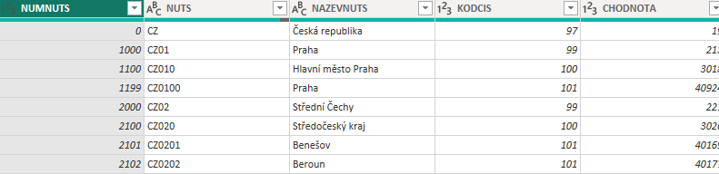
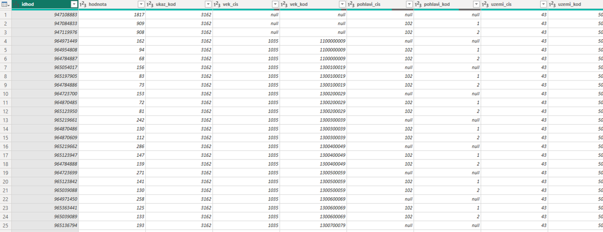
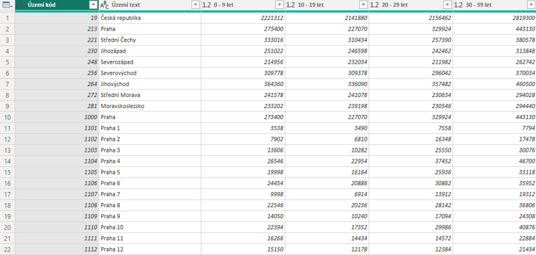
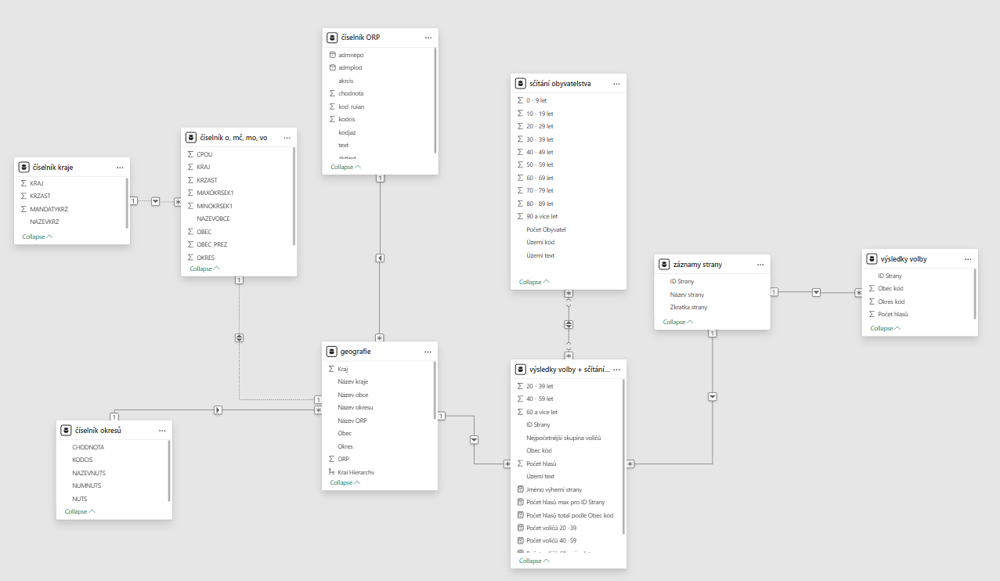
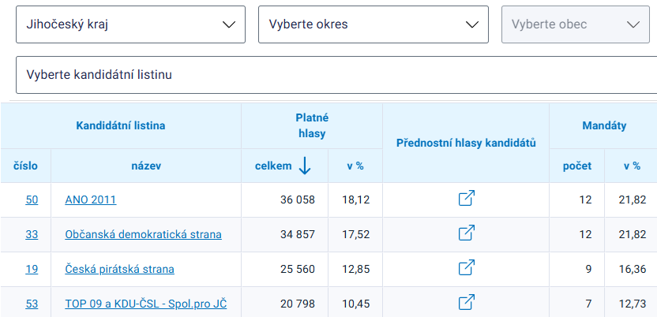
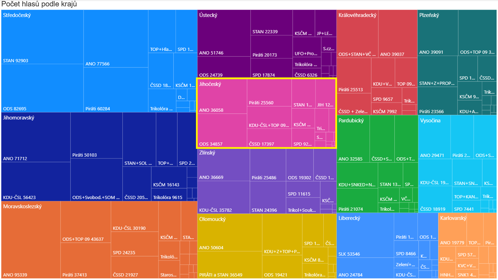
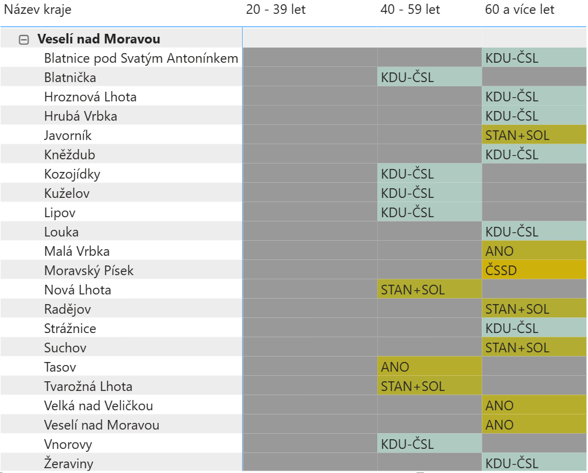

# Semestrální práce KIV/INS - Zpracování dat krajských voleb 2020

## Cíl semestrální práce
Cílem semestrální práce bylo zpracování dat z krajských voleb 2020 a sčítání obyvatelstva z roku 2021. Dalším cílem bylo nalezení případné závislosti mezi výsledkem voleb a věkem obyvatelstva v regionech.

## Datové sady
Zdrojem datových sad je [katalog Otevřených dat](https://data.gov.cz/datové-sady).
Nejdůležitější tabulky z datových sad se nacházejí ve složce `data`. Nejdůležitějšími jsou výsledky krajských voleb a sčítání obyvatelstva, kdy jsou záznamy rozděleny do 10 letých věkových skupin a také podle pohlaví. Tvůrcem datových sad je Český statistický úřad. K dispozici jsou také datové sady se stejným obsahem z jiných let. 
Zde jsou uvedeny jednotlivé datové sady z katologu Otevřených dat:
- [Volby do zastupitelstev krajů 2020 - okrsková data](https://data.gov.cz/datov%C3%A1-sada?iri=https%3A%2F%2Fdata.gov.cz%2Fzdroj%2Fdatov%C3%A9-sady%2F00025593%2F1d8961763f962539a732664d7298cd12)
- [Volby do zastupitelstev krajů 2020 – číselníky](https://data.gov.cz/datov%C3%A1-sada?iri=https%3A%2F%2Fdata.gov.cz%2Fzdroj%2Fdatov%C3%A9-sady%2F00025593%2Ff222946cae3f9cbc4a5737b8dcc2f275)
- [Volby do zastupitelstev krajů 2020 – registry](https://data.gov.cz/datov%C3%A1-sada?iri=https%3A%2F%2Fdata.gov.cz%2Fzdroj%2Fdatov%C3%A9-sady%2F00025593%2F794325bf01847224bb9115ebcf023846)
- [Sčítání 2021 - Obyvatelstvo podle desetiletých věkových skupin a pohlaví](https://data.gov.cz/datov%C3%A1-sada?iri=https%3A%2F%2Fdata.gov.cz%2Fzdroj%2Fdatov%C3%A9-sady%2F00025593%2Fa9f0285f38412dd0db10a77cb4e05420)
- [Číselník ČSÚ: Správní obvody obcí s rozšířenou působností (kód 65)](https://data.gov.cz/datov%C3%A1-sada?iri=https%3A%2F%2Fdata.gov.cz%2Fzdroj%2Fdatov%C3%A9-sady%2F00025593%2F75f8ed026a37e3c52e7365ad6b22acb7)

V tabulce níže jsou uvedené jednotlivé soubory/tabulky a parametry které byly využity při zpracování dat 

| Tabulka/Soubor | Popis souboru | Důležité parametry |
|----------------|---------------|--------------------|
| `kzt6p.csv`| Volební výsledky | `OKRES`, `OBEC`, `KSTRANA`, `POC_HLASU` |
| `sldb2021_vek10_pohlavi.csv`| Sčítání obyvatelstva věkové skupiny po 10 letech a pohlaví | `hodnota`, `uzemi_kod`, `vek_txt`, `uzemi_txt` |
| `kzkrl.csv` | Registr kandidátních listin | `KSTRANA`, `NAZEVCELK`, `ZKRATKA8` |
| `kzcoco.csv` | Číselník obcí | `KRAJ`, `OKRES`, `ORP`, `OBEC`, `NAZEVOBCE` |
| `kzciskr.csv` | Číselník krajů | `KRAJ`, `NAZEVKRZ` |
| `cnumnuts.csv` | Názvy krajů (NUTS) | `NUMNUTS`, `NAZEVNUTS` |
| `CIS0065_CS.csv` | Číselník ORP| `chhodnota`, `text` |

Většina tabulek je přirozeně propojitelná nejčastěji pomocí kódu LAU nebo NUTS. 
Například tabulka `cnumnuts.csv` je propojitelá pomocí atributu **NUMNUTS** s tabulkou `kzt6p.csv` přes atribut **OKRES**



## Transformace dat
### Tabulka sčítání obyvatelstva (`sldb2021_vek10_pohlavi.csv`)
Prvním krokem při úpravě dat v tabulce sčítání obyvatelstva bylo odstranění prázdných hodnot u atributu `vek_txt`. Dalším krokem bylo odstranění přebytečných sloupců, které byly pro naše řešení nerelevantní: `idhod`, `ukaz_kod`, `vek_cis`, `vek_kod`, `pohlavi_cis`, `pohlavi_kod`, `uzemi_cis`, `sldb_rok`, `sldb_datum`, `ukaz_txt`, `pohlavi_txt`

Následně došlo k přejmenování a přeuspořádní pořadí sloupců:
- `hodnota` -> `Počet obyvatel`
- `uzemi_kod` -> `Území kód`
- `vek_txt` -> `Věková skupina`
- `uzemi_text` -> `Území text`

Další operací provedenou nad daty byla operace **Group By**, kdy došlo k součtu počtu obyvatel podle dané věkové skupiny, územního kódu a textu. Poté jsme využili operaci **Pivot Column**  podle atributu `Věková skupina` s nastavením **Don´t agregate** podle Počtu obyvatel. Tudíž nám vznikly nové sloupce podle jednotlivých 10 letých skupin. Poté jsme také vytvořili nový sloupec pro věkovou skupinu `60 let a více`, který vznikl součtem hodnot ze sloupců `60 - 69 let`, `70 - 79 let`, `80 - 89 let`, `90 - 99 let` a `100 a více let`. Následně zmíněné sloupce byli odstraněny. Pro tuto operaci jsme se rozhodli z důvodu zanedbatelného vlivu na následnou analýzu a zmenšení tabulky sčítání obyvatelstva. Posledním krokem bylo vytvoření sloupce `Počet obyvatel`, který díky pivotaci zmizel. 

Zde je uvedena původní podoba tabulky:


Výsledná podoba tabulky sčítání obyvatelstva je uvedena zde:


### Tabulka výsledky voleb (`kzt6p.csv`)
První operací nad touto tabulkou bylo ddstranění pro nás nepodstatných sloupců, kdy byly zachovány tyto sloupce: `OKRES`, `OBEC`, `KSTRANA`, `POC_HLASU`. Dalším krokem bylo opět přejmenování jednotlivých atributů:
  - `OKRES` -> `Okres kód`
  - `OBEC` -> `Obec kód` 
  - `KSTRANA` -> `ID Strany`
  - `POC_HLASU` -> `Počet Hlasů`
  
Konečnou operací nad tabulkou výsledky voleb byla provedení operace **GroupBy*, kdy došlo k součtu hlasů pro jednotlivé strany podle sloupců `Okres kód`, `Obec kód`, `ID strany`.


### Tabulka výsledky voleb + sčítání obyvatelstva
Tato tabulka vznikla spojení tabulek sčítání obyvatelstva a výsledků voleb. Toto spojení bylo realizováno pomocí operace `Merge` přes sloupec `Obec kód` a `Území kód`.
V této nové faktové tabulce došlo nadále k úpravě věkových skupin obvytel. Nejprve byly odstraněny sloupce s věkovými skupinami `0 - 9 let` a `10 - 19 let` z důvodu, že se nejedná o obyvatele s volebním právem a tudíž jsou nám tato data nepotřebná pro naši analýzu. Dále došlo ke spojení skupin obyvatel do 20 letých věkovýc skupin `20 - 39 let`, `40 - 59 let`, `60 a více let`. K tomuto došlo z důvodu snažší interpretace výsledků, kdy například rozdíl mezi věkovými skupinami `20 - 29 let` a `30 - 39 let`, je z našeho pohledu zanedbatelný.
Také zde byl vytvořen sloupec `Nejpočetnější skupina voličů` obsahující informaci o nejpočetnější skupině voličů.

Bylo zde také vytvořeno několik **DAX mír**, které vypočítávají data pro vizualizaci. Například DAX míra pro výpočet počtu hlasů pro každou stranu v obci:
```
Počet hlasů total podle Obec kód = 
CALCULATE(
	SUM('výsledky volby + sčítání obyvatelstva'[Počet hlasů]),
	ALLSELECTED('výsledky volby + sčítání obyvatelstva'[Obec kód])
)
```

### Tabulka záznamy stran (`kzkrl.csv`)
Nejprve došlo k odstranění přebytečných atributů tabulky a byly zachovány tyto atributy `KSTRANA`, `NAZEVCELK`, `ZKRATKAK8`.
Také zde došlo k přejmenování zachovaných atributů: 
  - `KSTRANA` -> `ID Strany`
  - `NAZEVCELK` -> `Název strany`
  - `ZKRATKAK8` -> `Zkratka strany`

Poslední úpravou této tabulky bylo odstranění duplicitních záznamů, které obsahovaly seznam stran pro každý kraj, ale identifikátor strany byl v každém kraji stejný. Naším cílem bylo vytvoření unikátní seznamu stran.


### Tabulky geografie 
Tabulka geografie vznikla pomocí spojení těctho dimenzních tabulek:
  -  číselník obcí, městských částí, městských obvodů a volebních okrsků (`kzcoco.csv`)
  -  číselník krajů (`kzciskr.csv`)
  -  číselník ORP (`CIS0065_CS.csv`)
  -  číselník okresů (`cnumnuts.csv`)

Po spojení tabulek došlo k odstranění přebytečných sloupců pro naše zadání: `CPOU`, `KRZAST`, `MINOKRSEK1`, `MAXOKRSEK1`, `OBEC_PREZ`

Posledním krokem při tvorbě tabulky geografie bylo přejmenování sloupců: 
  - `KRAJ` -> `Kraj`
  - `číselník kraje.NAZEVKRZ` -> `Název kraje`
  - `OKRES` -> `Okres`
  - `číselník okresů.NAZEVNUTS` -> `Název okres`
  - `ORP` -> `ORP`
  - `číselník ORP.text` -> `Název ORP`
  - `OBEC` -> `Obec`
  - `NAZEVOBCE` -> `Název obce`

Po všech úpravách tabulky byly pro tuto tabulku vytvořeny dvě Hierarchie a to `Kraj Hierarchy` a `Název Kraje Hierarchy`, jedna obsahuje číselné kódy oblastí a druhá pouze názvy jednotlivých oblastí. Tyto hierarchie byly vytvořeny z důvodu lepšívizualizace dat.

## ERA model
Po výše zmíněné transformaci dat byl vytvořen ERA model a byly zde nastaveny vazby mezi tabulkami především mezi tabulkou **geografie** a **výsledky volby + sčítání obyvatelstva** pomocí atributu `Obec` a `Obec kód`.



## Závěr
Výsledky krajských voleb 2020, které byly v rámci této semestrální práce zpracovávány odpovídají oficiálním výsledkům, které zpracoval Český statistický úřad viz obrázky.




Závislosti mezi volebním výsledkem a nejpočetnější skupinou voličů v regionu nebyla zcela prokázána, jelikož se nedá z jistotou říci, že daná skupina obyvatel volila jednu a tu samou stranu skrze více oblastí. Nejvíce pro potvrzení tohoto závěru vypovídají data z jednotlivých obcí viz obrázek:



Nejtěžší na celé práci bylo pochopení zvolených datasetů, které nemají vždy zcela výstižné schéma ze kterého by bylo na první pohled zřejmé jaké atributy obsahují určitá data.

V průběhu zpracování práce, jsme narazili na problém s datovou sadou `sldb2021_vek1_pohlavi.csv`, kterou jsme původně chtěli používat. Problémem byla absence dat o sčítání obyvatel ve velmi malých obcích. Tato absence nám způsobovala problémy při spojování tabulek sčítání obyvatelstva a výsledků voleb, kdy při spojení chyběli pro určité obce data o věkových skupinách obyvatel.